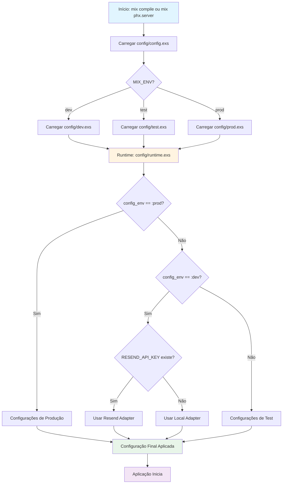

# Configuration Guide

Este documento explica como funciona o sistema de configuração do PodCodar, incluindo a ordem de precedência e como cada arquivo de configuração é carregado.

## Arquivos de Configuração

O Phoenix Framework carrega configurações em uma ordem específica. Aqui estão os arquivos de configuração do PodCodar e quando eles são executados:

### 1. `config/config.exs`
**Quando:** Compile-time (durante `mix compile`)  
**Ordem:** Primeiro arquivo carregado  
**Propósito:** Configuração base compartilhada entre todos os ambientes

```elixir
# Configurações comuns a todos os ambientes
config :podcodar, Podcodar.Mailer, adapter: Swoosh.Adapters.Local
```

### 2. `config/dev.exs`
**Quando:** Compile-time (apenas em desenvolvimento)  
**Ordem:** Carregado após `config.exs` quando `MIX_ENV=dev`  
**Propósito:** Configurações específicas de desenvolvimento

```elixir
# Sobreposições configurações de config.exs
config :podcodar, Podcodar.Repo,
  database: Path.expand("../podcodar_dev.db", __DIR__)
```

### 3. `config/test.exs`
**Quando:** Compile-time (apenas em testes)  
**Ordem:** Carregado após `config.exs` quando `MIX_ENV=test`  
**Propósito:** Configurações específicas de testes

```elixir
# Configurações para ambiente de teste
config :podcodar, Podcodar.Mailer, adapter: Swoosh.Adapters.Test
```

### 4. `config/prod.exs`
**Quando:** Compile-time (apenas em produção)
**Ordem:** Carregado após `config.exs` quando `MIX_ENV=prod`  
**Propósito:** Configurações específicas de produção

```elixir
# Configurações de produção
config :swoosh, api_client: Swoosh.ApiClient.Req
```

### 5. `config/runtime.exs`
**Quando:** Runtime (antes da aplicação iniciar)
**Ordem:** Último arquivo executado, sobrescreve tudo  
**Propósito:** Configurações dinâmicas baseadas em variáveis de ambiente

```elixir
# Configurações baseadas em variáveis de ambiente
config :podcodar, Podcodar.Mailer,
  adapter: Resend.Swoosh.Adapter,
  api_key: System.fetch_env!("RESEND_API_KEY")
```

## Ordem de Precedência

A configuração final é determinada pela seguinte ordem de precedência (maior precedência primeiro):

```
1. config/runtime.exs (Runtime) → MAIOR PRECEDÊNCIA
2. config/{env}.exs (Compile-time por ambiente)
→ config/prod.exs (se MIX_ENV=prod)
→ config/dev.exs (se MIX_ENV=dev)
→ config/test.exs (se MIX_ENV=test)
3. config/config.exs (Compile-time base) → MENOR PRECEDÊNCIA
```

## Diagrama de Fluxo de Configuração



## Como Usar

### Desenvolvimento

Em desenvolvimento, o sistema usa configurações de `config/dev.exs` e pode ser sobrescrito por `config/runtime.exs`:

```bash
# Sem variáveis de ambiente: usa mailbox local
mix phx.server

# Com RESEND_API_KEY: usa Resend adapter
export RESEND_API_KEY=re_xxxxx
mix phx.server
```

### Testes

Em testes, `config/test.exs` define configurações específicas:

```bash
# Sempre usa Swoosh.Adapters.Test
mix test
```

### Produção

Em produção, `config/runtime.exs` tem precedência total:

```bash
# Todas as configurações vêm de variáveis de ambiente
MIX_ENV=prod mix phx.server
```

## Variáveis de Ambiente

### Obrigatórias em Produção

- `RESEND_API_KEY` - API key do Resend (obrigatória em produção)
- `DATABASE_PATH` - Caminho do banco de dados SQLite
- `SECRET_KEY_BASE` - Chave secreta para sessões
- `DISCORD_INVITE_URL` - URL do Discord
- `GITHUB_ORG_URL` - URL da organização GitHub
- `SPONSOR_URL` - URL do patrocinador

### Opcionais

- `EMAIL_FROM_ADDRESS` - Endereço de email do remetente (padrão: `contact@example.com`)
- `EMAIL_FROM_NAME` - Nome do remetente (padrão: `Podcodar`)
- `PHX_HOST` - Host da aplicação (padrão: `example.com`)
- `PORT` - Porta do servidor (padrão: `4000`)
- `POOL_SIZE` - Tamanho do pool de conexões (padrão: `5`)
- `RESEND_API_KEY` - Em desenvolvimento, habilita testes com Resend

## Exemplos Práticos

### Exemplo 1: Configuração de Email

```elixir
# config/config.exs (padrão)
config :podcodar, Podcodar.Mailer, adapter: Swoosh.Adapters.Local

# config/runtime.exs (runtime, sobrescreve)
if config_env() == :prod do
  config :podcodar, Podcodar.Mailer,
    adapter: Resend.Swoosh.Adapter,
    api_key: System.fetch_env!("RESEND_API_KEY")
end
```

**Resultado:**
- Desenvolvimento: `Swoosh.Adapters.Local` (do `config.exs`)
- Produção: `Resend.Swoosh.Adapter` (do `runtime.exs`)

### Exemplo 2: Configuração de Banco de Dados

```elixir
# config/config.exs (não define Repo)
# config/dev.exs
config :podcodar, Podcodar.Repo,
  database: Path.expand("../podcodar_dev.db", __DIR__)

# config/runtime.exs
if config_env() == :prod do
  config :podcodar, Podcodar.Repo,
    database: System.fetch_env!("DATABASE_PATH")
end
```

**Resultado:**
- Desenvolvimento: `podcodar_dev.db` (do `dev.exs`)
- Produção: valor de `DATABASE_PATH` (do `runtime.exs`)

### Exemplo 3: Configuração Condicional em Runtime

```elixir
# config/runtime.exs
if config_env() == :dev do
  if System.get_env("RESEND_API_KEY") do
    # Sobrescreve configuração base se variável existir
    config :podcodar, Podcodar.Mailer,
      adapter: Resend.Swoosh.Adapter
  end
end
```

**Resultado:**
- Sem `RESEND_API_KEY`: usa configuração de `config.exs`
- Com `RESEND_API_KEY`: usa Resend adapter

## Boas Práticas

### ✅ Faça

- Use `config/config.exs` para valores padrão compartilhados
- Use `config/{env}.exs` para configurações específicas de ambiente em compile-time
- Use `config/runtime.exs` para configurações baseadas em variáveis de ambiente
- Use `System.get_env/2` com valores padrão quando apropriado
- Use `System.fetch_env!/1` para variáveis obrigatórias em produção

### ❌ Não Faça

- Não coloque secrets em arquivos de configuração commitados
- Não use `System.get_env/1` seguido de `||` quando `System.get_env/2` funciona
- Não misture lógica de runtime em arquivos de compile-time
- Não assuma que configurações de compile-time existem em runtime

## Resolução de Problemas

### Minha configuração não está sendo aplicada

1. Verifique a ordem de precedência acima
2. Confirme que está editando o arquivo correto para o ambiente
3. Verifique se `runtime.exs` não está sobrescrevendo sua configuração
4. Reinicie o servidor após alterar configurações

### Variáveis de ambiente não estão sendo lidas

1. Verifique que está usando `config/runtime.exs` (não `config.exs`)
2. Confirme que a variável está definida: `echo $VAR_NAME`
3. Em desenvolvimento, reinicie o servidor após definir variáveis
4. Em produção, configure via `fly secrets set` ou similar

### Configuração funciona em dev mas não em produção

1. Verifique se há configuração específica em `config/prod.exs`
2. Confirme que `config/runtime.exs` tem o bloco `if config_env() == :prod`
3. Verifique se todas as variáveis de ambiente obrigatórias estão definidas

## Referências

- [Phoenix Configuration Guide](https://hexdocs.pm/phoenix/config.html)
- [Elixir Config Module](https://hexdocs.pm/elixir/Config.html)
- [System.get_env/2](https://hexdocs.pm/elixir/System.html#get_env/2)
- [Mix Environments](https://hexdocs.pm/mix/Mix.html#env/0)